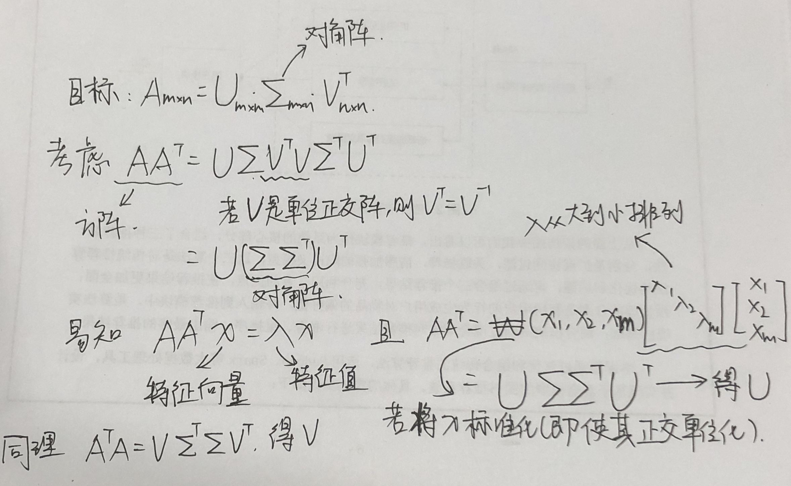
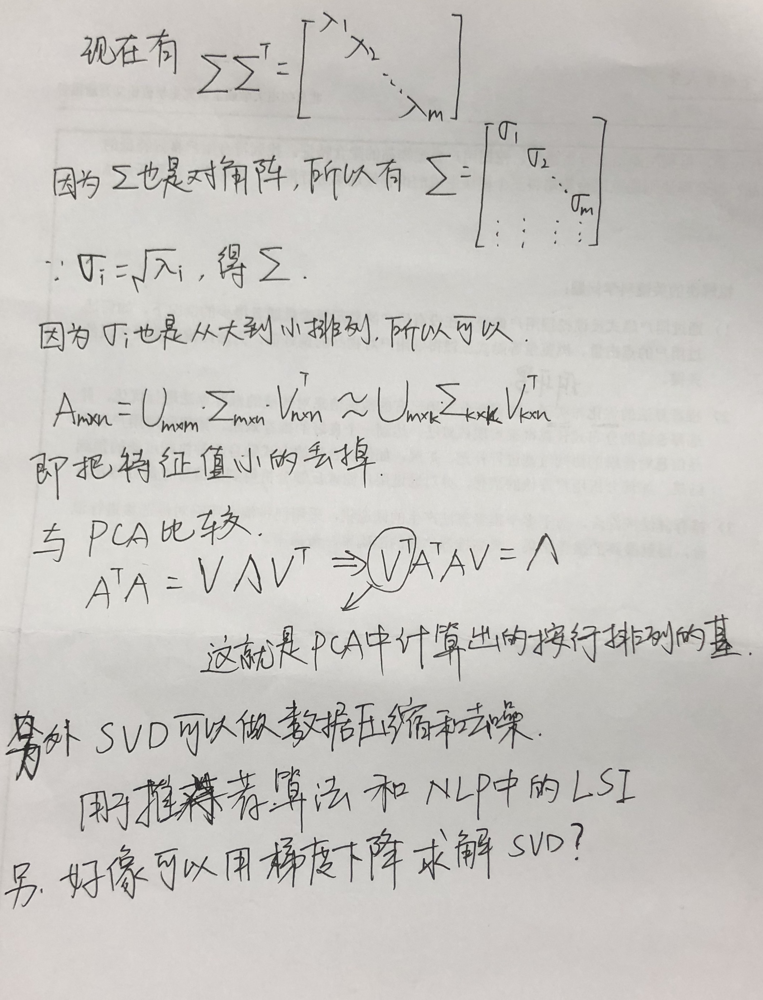

# PCA and SVD
## PCA
[一篇巨厉害的文章](http://blog.codinglabs.org/articles/pca-tutorial.html)
首先需要知道的一个很关键的东西叫做基变换。
例如对于日常的二维图像来说，它的基是
$$ \begin{pmatrix} 1 & 0 \\ 0 & 1 \\ \end{pmatrix} $$
对于点$(3,2)$，就有
$$ \begin{pmatrix} x\\y \end{pmatrix}=\begin{pmatrix} 1 & 0 \\ 0 & 1 \\ \end{pmatrix}  \begin{pmatrix} 3\\2 \end{pmatrix} $$
于是有$x=3$，$y=2$
现在考虑变换点$(3,2)$的基，其实很简单，例如有基
$$ \begin{pmatrix} \frac{1}{\sqrt{2}} & \frac{1}{\sqrt{2}} \\ -\frac{1}{\sqrt{2}} & \frac{1}{\sqrt{2}} \\ \end{pmatrix} $$
那么在新基上的坐标就变为了
$$ \begin{pmatrix} x\\y \end{pmatrix}=\begin{pmatrix} \frac{1}{\sqrt{2}} & \frac{1}{\sqrt{2}} \\ -\frac{1}{\sqrt{2}} & \frac{1}{\sqrt{2}} \\ \end{pmatrix}  \begin{pmatrix} \frac{5}{\sqrt{2}}\\ -\frac{1}{\sqrt{2}}\\ \end{pmatrix}$$
需要注意的是这里举的例子中，基是正交的（即基的内积为0，或者说是相互垂直），但是其实只要线性无关就可以被称为基了，所以使用非正交基也可以的，这里使用正交基是因为正交基的性质更好。顺便的，这里就给矩阵相乘赋予了一个物理解释：两个矩阵相乘的实质就是把第二个矩阵中的坐标（即每一列列向量）转换到左边矩阵中的基（即每一列行向量）所表示的空间中。

所以说，如何利用基进行数据的降维？基可以看成是由$N$个$K$维行向量按行排成的矩阵，其维度是$K\times N$，然后需要转换的坐标看做是$N$个$M$维列向量按列排成的矩阵，其维度是$N\times M$，矩阵相乘后会变为一个$K\times M$的矩阵，如果$K<M$，那么很自然的，数据就被降维了。

那么怎样保证数据被降维的同时还保留尽可能多的信息？这就是PCA的关键一步。

如果是对于二维数据降到一维，想要保证降维后保留尽可能多的信息，实质就是让坐标投影到新空间中的方差尽可能大。

但是如果是三维降到二维的话，与上面相同的，可以找到一个方向使坐标投影后使方差最大，第二个方向要怎么找？如果跟找第一个方向的策略一样的话，会发现两个方向是完全重合的，因为第一个方向就是使投影后方差最大的方向，而我们的目的其实是想让投影到不同方向上的点保持更多的信息，这样就相当于是我们不想让两个方向具有相关性，也就是说,我们需要使不同的字段的协方差为0.

通过这两段的分析其实就得到了PCA的优化目标：**将一组N维向量降为K维（K大于0，小于N），其目标是选择K个单位（模为1）正交基，使得原始数据变换到这组基上后，各字段两两间协方差为0，而字段的方差则尽可能大（在正交的约束下，取最大的K个方差）**。

好了，那么现在先来计算原始数据矩阵的协方差矩阵。
这里可以优化的一点是，可以先对每个字段的数据做归一化，就是对于一组数据来说，数据中的每一项都减去这组数据的均值。这样做之后就可以使得每个字段的数据的期望都为0，于是对于转换后的矩阵$X$，其协方差矩阵就等于
$$\frac{1}{m}XX^T$$
其中
$$X=\begin{pmatrix}a_1 & a_2 &...& a_m \\ b_1&b_2&...&b_m \end{pmatrix}$$
在相乘后，可以比较明显的看出，处于对角线上的值就是$X$的方差，非对角线上的值就是协方差。那么要用什么样的矩阵去乘$X$才能使协方差都为0呢？这里来推导一下，这里令$P$为基按行排列组成的矩阵，$Y$是做基变换后的矩阵，$D$是所有协方差都为0的目标矩阵
$$
    \begin{aligned}
        D&=\frac{1}{m}YY^T \\
        &=\frac{1}{m}(PX)(PX)^T \\
        &=P(\frac{1}{m}XX^T)P^T \\
        &=PCP
    \end{aligned}
$$
$C$是$X$的协方差矩阵。
现在问题就转变成了，怎样才能使对称阵$C$做矩阵对角化？（因为$D$的协方差为0，即$D$是一个对角阵）
这就很简单了，因为$C$是对称矩阵，所以只要找到$C$的$n$个单位正交特征向量以及特征向量对应的特征值就能得到答案了，令单位正交特征向量为
$$E=(e_1,e_2,...,e_n)$$
那么有

$$E^TCE=\begin{pmatrix}\lambda_1&& \\ &\lambda_2&\\ &&\lambda_n\end{pmatrix}$$
这个特征值就是方差啊！若特征值是从大到小排列的话，想把数据降到几维，就取几行$E$就行了。

## SVD

